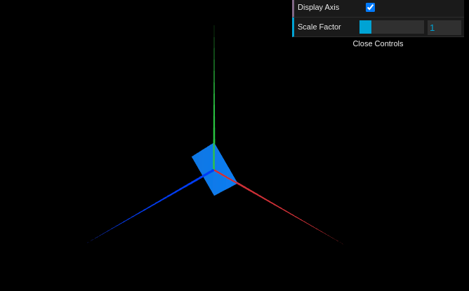
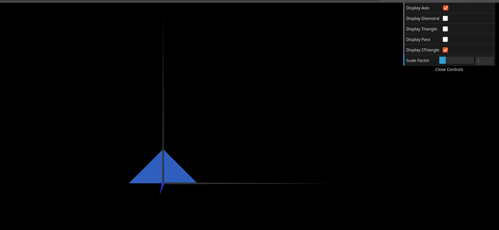
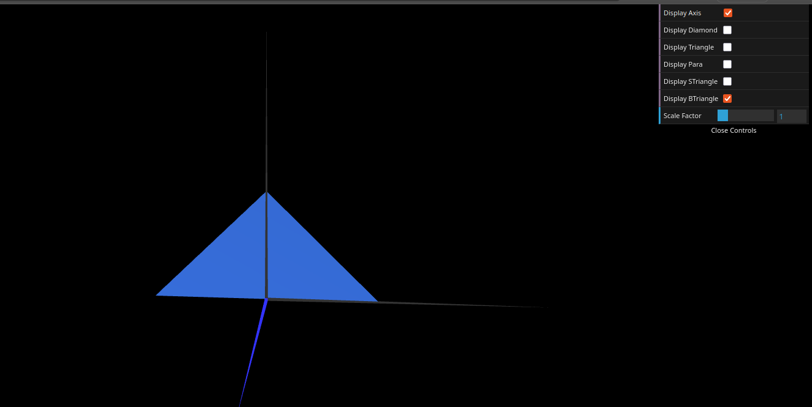

# CG 2025/2026

## Group T02G02

## TP 1 Notes

- In exercise 1 we observed that while the overall setup of creating subclasses was not very complicated, it was a bit strange at first to figure out the specific order of the indices to ensure the faces rendered correctly.

- In exercise 2 we had difficulties in the slightly confusing logic of the indices, though the implementation remained straightforward once the base concepts were understood.

