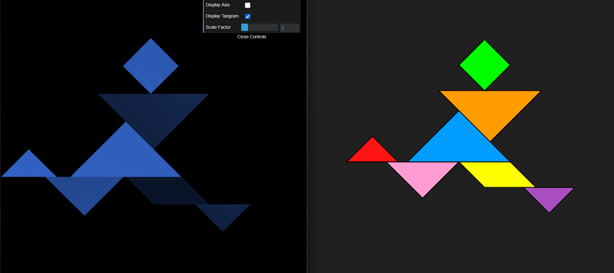
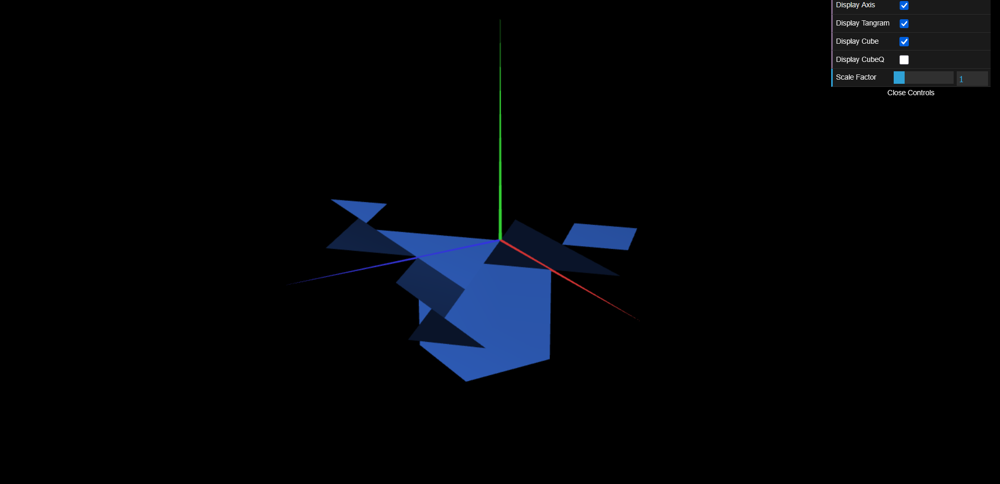
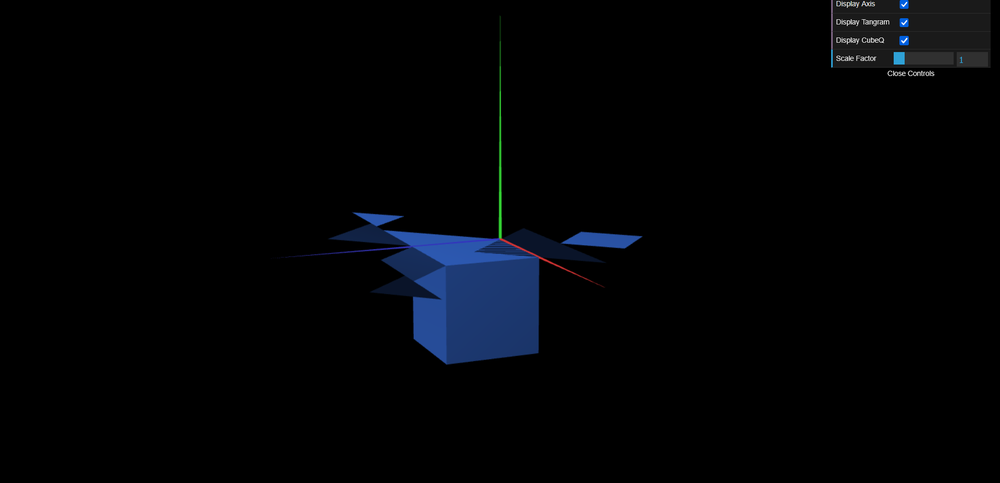

# CG 2025/2026

## Group T02G02

## TP 2 Notes

- In exercise 1 we noticed that, although the exercise itself was pretty straightforward, we found it somewhat difficult and confusing to understand exactly what functions we should use and exactly how to use them. Once we got that figured out, it was relatively easy to do.

- In exercise 2, our main difficulty was understanding exactly what the exercise required, as the overcomplicated and unclear wording left us unsure of which steps to take.

- In exercise 3 we didn't have any major difficulties, as the previous exercises prepared us well for this one. Despite this, there was a bit of trial and error when we had to rotate the sides of the cube to make it.

