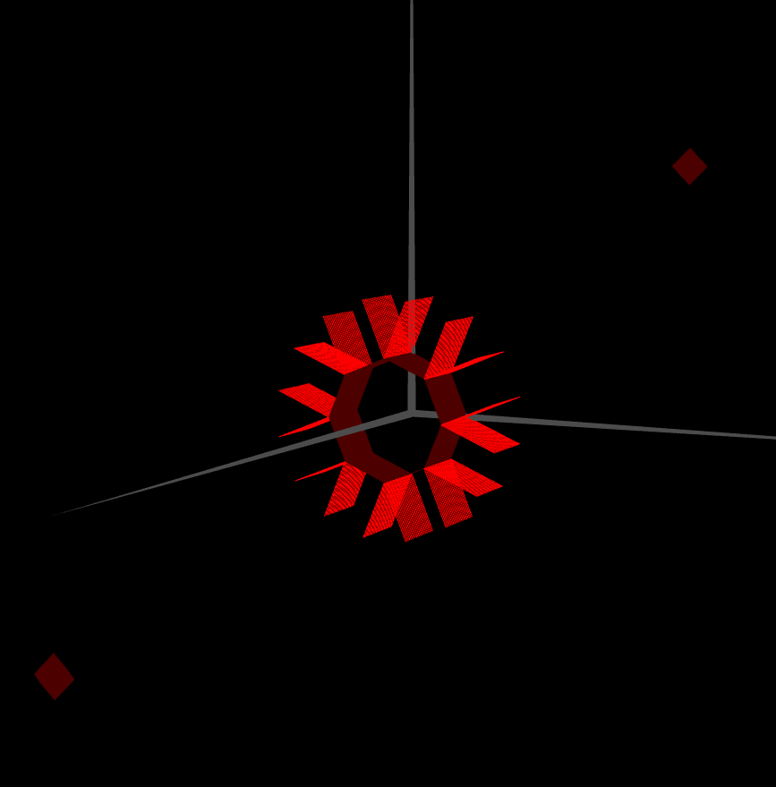
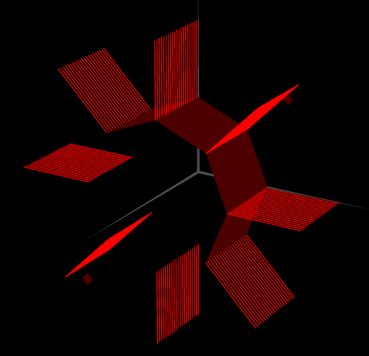

# CG 2025/2026

## Group T02G02

## TP 3 Notes

- In exercise 1 we struggled with the functionalities of the functions and lights, but, once when got the hang of it, it was fairly straight forward.

- In exercise 2 it was very hard to just understand how we were supposed to begin. The logic of starting out by drawing a fixed point on the x-axis and going from there was hard to comprehend. Also it was a bit confusing simply organising the code so its readable and compreehensable with so many loops and variables working at the same time. The diagonal normals were also confusing at the beginning, but as always, once the first one was done it was pretty easy to do the rest of them.

- In exercise 3, our main strugle was figuring out how we would build the MyCylinder class.

