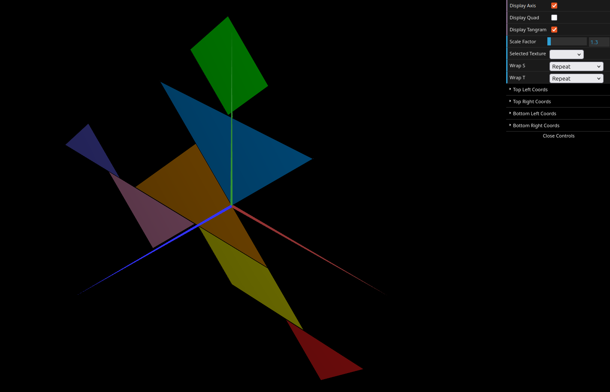
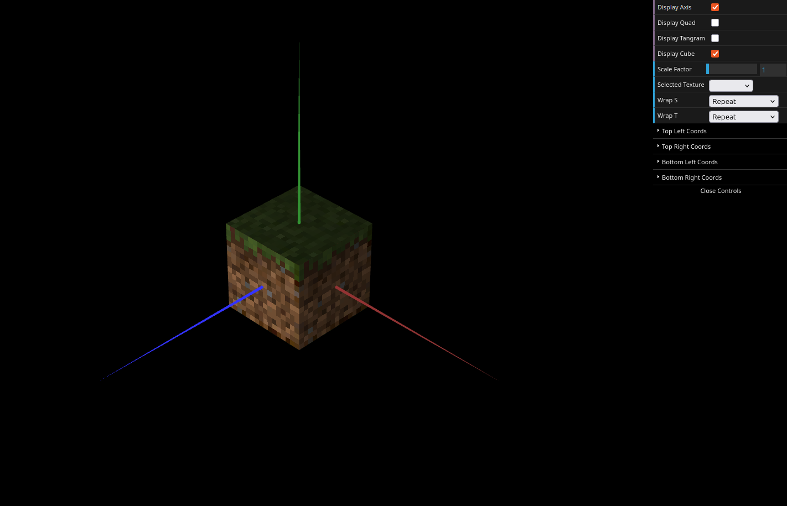

# CG 2025/2026

## Group T02G02

## TP 4 Notes

- In exercise 1 we struggled to map the tangram.png coordinates accurately to each piece, but the process became easier once we identified the vertex positions in the (s, t) space.

- In exercise 2 our main difficulty was implementing the MyUnitCubeQuad to accept six different textures and applying NEAREST filtering to fix the blurriness of the low-resolution Minecraft sprites.