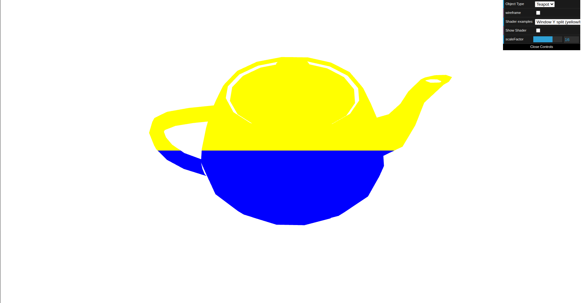
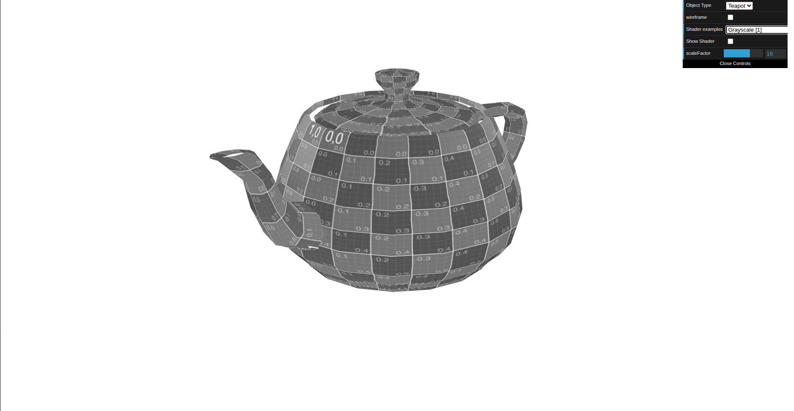
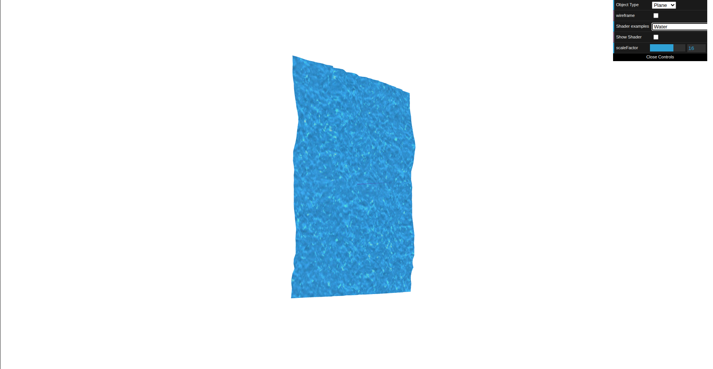

# CG 2025/2026

## Group T02G02

## TP 5 Notes

- In exercise 1 we had some difficulty understanding how each shader stage should be used and how to pass data between vertex and fragment shaders. After setting up the first examples and testing uniforms and varyings, it became much easier to reason about the remaining shaders.

- We didn't encounter any huge difficulties while implementing grayscale. It was pretty straightforward.

- In exercise 3 the main challenge was animating the plane in a smooth and coherent way. It took a few attempts to tune the UV offsets and time factor so the water looked natural while keeping the displacement effect stable. The most challenging part was integrating the water shaders in the scene and correctly mapping the two textures to their roles. We initially used the map texture to affect color, but then adjusted it so that the map is only used as a heightmap while the final color comes from the water texture.

